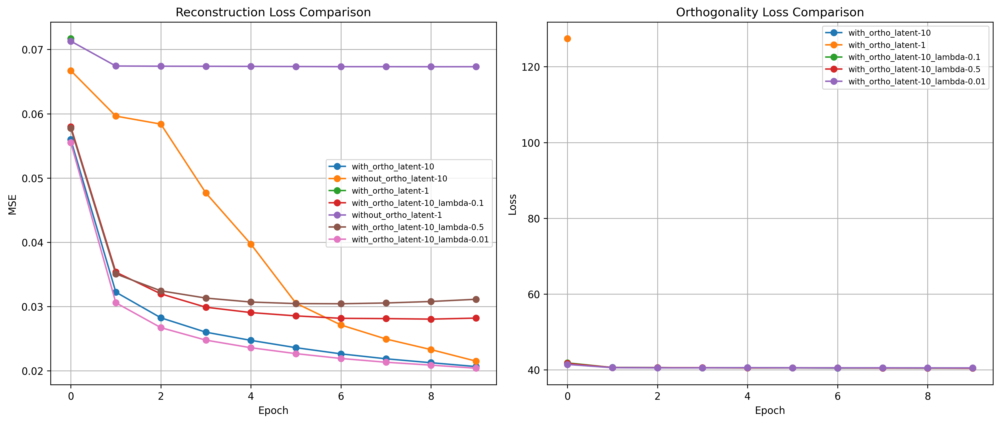
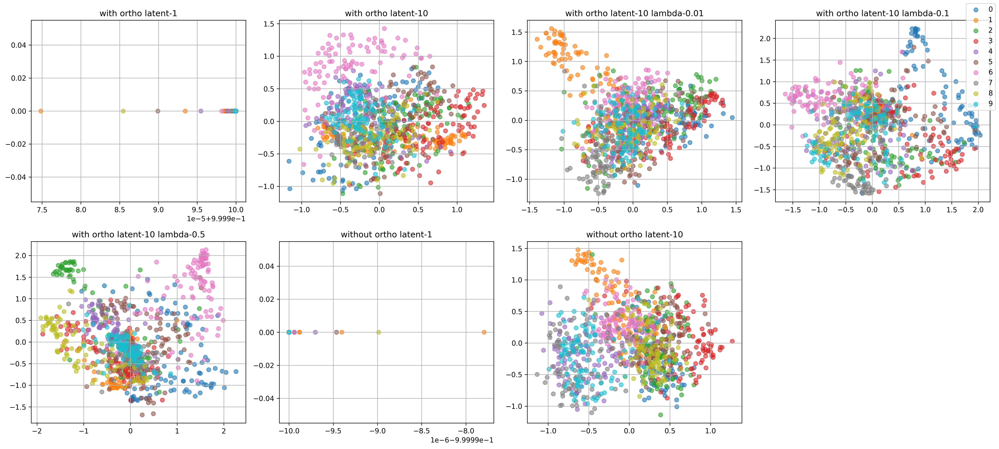

# Representation Learning with Autoencoder <!-- omit in toc -->

This project explores representation learning using an Autoencoder and investigates the impact of Orthogonal Regularization on latent space structure.

An Autoencoder is trained on image data to learn compressed latent representations.
We compare two cases:

1. ✅ Standard Autoencoder (Reconstruction Loss only)
2. ✅ Autoencoder with Orthogonal Loss Regularization

The goal is to analyze:

- Reconstruction performance
- Latent space structure
- Effect of orthogonal constraints on representation learning

Orthogonal regularization encourages decorrelated latent features, leading to more structured and independent embeddings.

---

## Table of Contents <!-- omit in toc -->

- [Installation](#installation)
- [Usage](#usage)
- [Development Notes](#development-notes)
- [Experiments](#experiments)

## ⚙️ Clone and Installation

### 1️⃣ Clone the Repository

```bash
git clone https://github.com/bhatishan2003/representation-learning-with-autoencoder.git
cd representation-learning-with-autoencoder
```

## 🚀 Usage

The training script supports an optional flag to enable orthogonal regularization.

### 🔹 Train WITHOUT Orthogonal Loss

```bash
python train.py
```

- This will train a standard autoencoder using reconstruction loss only.

### 🔹 Train WITH Orthogonal Loss

```bash
python train.py --use-orthogonal-loss
```

- This will train the autoencoder with an additional orthogonal regularization term.

## 📊 6. Training Graph Comparison

Below is the comparison of training losses for both models.

### 🔹 Reconstruction Loss & Orthogonal Loss

- The left graph shows Reconstruction Loss (with and without orthogonal regularization).
- The right graph shows Orthogonal Loss (when enabled).



---

## 🌌 7. Latent Space Visualization

## 🔬 Latent Space Comparison

We trained 7 configurations:

- Without orthogonal loss (latent = 1, 10)
- With orthogonal loss (latent = 1)
- With orthogonal loss (latent = 10, λ = 0.01, 0.1, 0.5)

### 🔎 Observations

- **Latent = 1** → Representations collapse into a line. No meaningful separation.
- **Without Orthogonal Loss (latent = 10)** → Overlapping clusters, correlated features.
- **With Orthogonal Loss (latent = 10)** → More structured and separated clusters.

As λ increases:
- Better feature decorrelation
- Clearer geometric structure
- Slight drop in reconstruction quality



## Development Notes

- Pre-commit

    We use pre-commit to automate linting of our codebase.
    - Install hooks:
        ```bash
        pre-commit install
        ```
    - Run Hooks manually (optional):
        ```bash
        pre-commit run --all-files
        ```

- Ruff:
    - Lint and format:
        ```bash
        ruff check --fix
        ruff format
        ```
